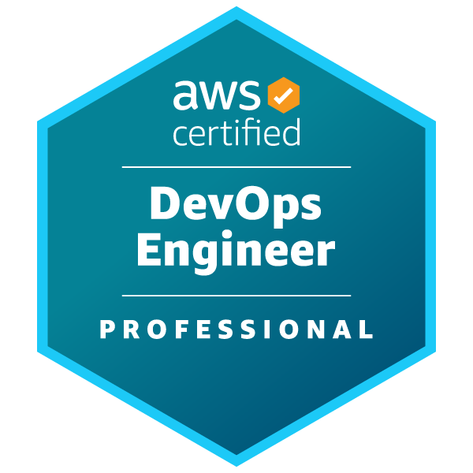
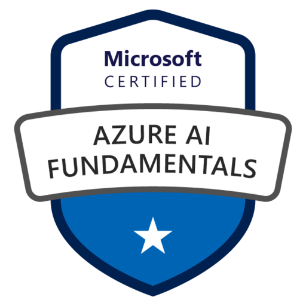
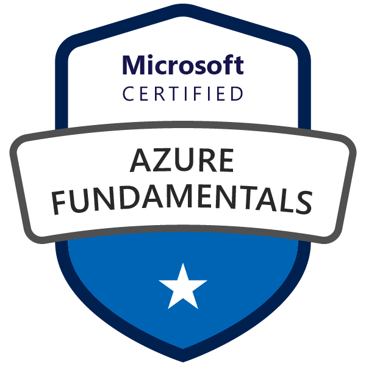
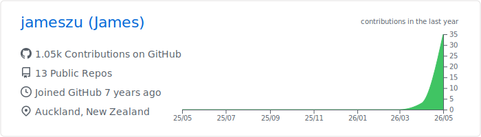
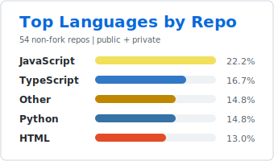
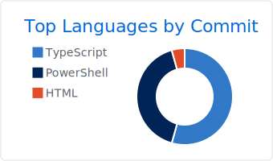
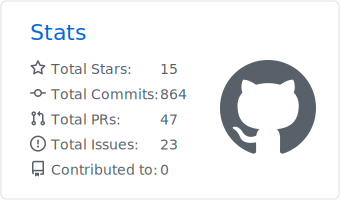
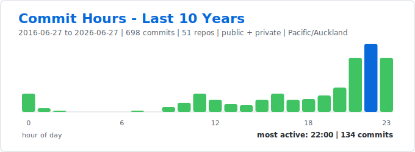

# Hi, I'm James You 👋
## ☁️ Cloud • DevOps • AI • Full-stack Software

> Turning cloud infrastructure, automation, and AI ideas into practical software that ships.

#### 🧰 Tech Stack

    
    
    
    
    
    
    
    
    

#### 🏅 Certifications

    
    
    
    
    

#### 🚀 About

- ☁️ Building around cloud infrastructure, automation, and web applications.
- ⚙️ Interested in DevOps, distributed systems, AI tooling, and practical software delivery.
- 📬 Reach me at [jamesyou.careers@gmail.com](mailto:jamesyou.careers@gmail.com) or on [LinkedIn](https://www.linkedin.com/in/jams-you/).

#### 📊 GitHub Snapshot

 

#### 🎮 GLHF

